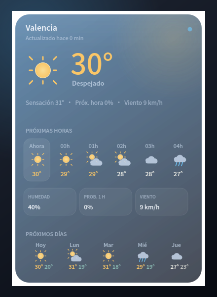
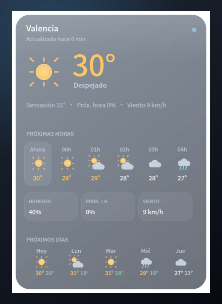
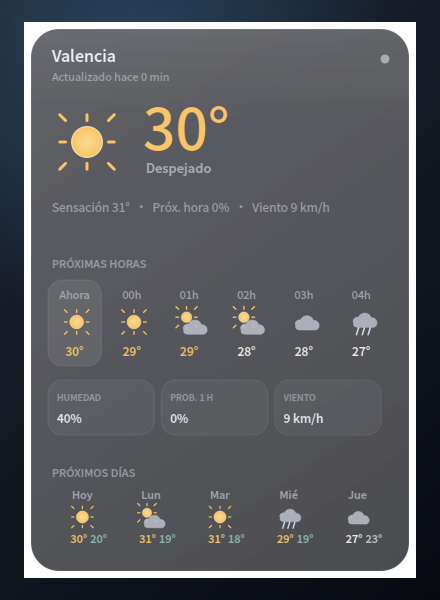
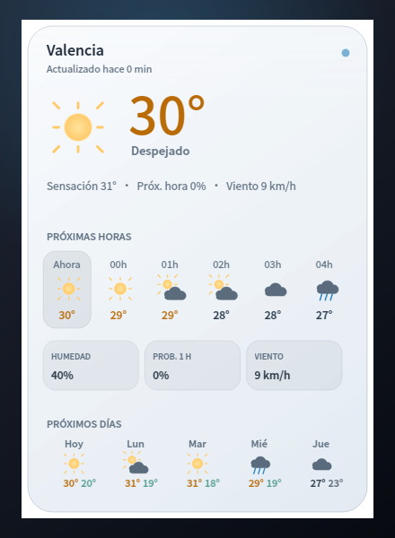

# Weather Widget Premium

Widget meteorológico de escritorio premium para Linux (X11 y Wayland), desarrollado como producto independiente de Weather Widget Classic.


## Características

| Feature | Descripción |
|---------|-------------|
| **Iconos vectoriales** | Sol, luna, nubes, lluvia, nieve y tormenta sin emojis del sistema |
| **Clima en tiempo real** | Open-Meteo como proveedor principal, con reintentos y validación de respuesta |
| **Geolocalización** | Ciudad exacta guardada o detección por IP opcional; nunca sustituye silenciosamente otra ciudad |
| **Buscador de ciudades** | Autocompletado con ciudad, región, país y coordenadas exactas |
| **Expandible** | Clic para ver humedad, viento y sensación térmica |
| **Glassmorphism** | Opacidad de fondo de 0–80% y temas Atmospheric, Glass, Minimal y Pearl |
| **Arrastrable** | Mover el widget con el ratón |
| **Instalación independiente** | Ejecutable, paquete, configuración y entrada de aplicaciones propios |
| **Forecast completo** | Previsión horaria y diaria expandible sin clipping |
| **Red no bloqueante** | Las consultas se ejecutan fuera del hilo de interfaz |
| **Unidades reales** | Cambio entre °C/km/h/mm y °F/mph/in desde el menú contextual |

## Apariencias

Capturas generadas directamente por el renderer de Weather Widget Premium con los mismos datos de demostración, tamaño y opacidad.

<table>
  <tr>
    <th>Atmospheric</th>
    <th>Glass</th>
  </tr>
  <tr>
    <td></td>
    <td></td>
  </tr>
  <tr>
    <th>Minimal</th>
    <th>Pearl</th>
  </tr>
  <tr>
    <td></td>
    <td></td>
  </tr>
</table>

## Requisitos

- Python 3.8+
- PyQt6
- requests
- Linux (GNOME, KDE o similar)

## Instalación rápida

```bash
git clone https://github.com/yhas1984/Weather-Widget-Premium.git
cd Weather-Widget-Premium
python -m venv venv
source venv/bin/activate
pip install -r requirements.txt
python run_premium.py
```

## Uso

```bash
python run_premium.py
```

El widget aparecerá en la esquina inferior derecha de la pantalla.

### Interacciones

| Acción | Efecto |
|--------|--------|
| **Clic** | Expandir/colapsar detalles |
| **Arrastrar** | Mover widget |
| **Clic derecho** | Menú de opciones |
| **Cambiar ciudad** | Menú contextual → Cambiar Ciudad |

## APIs Meteorológicas

| API | Prioridad | Descripción |
|-----|-----------|-------------|
| Open-Meteo | Principal | Clima actual y previsiones; selección automática del mejor modelo disponible |
| GeoNames | Geocodificación | Base de datos utilizada por el buscador de Open-Meteo |
| ipapi.co | Opcional | Ubicación aproximada por IP cuando no se ha elegido una ciudad |

El porcentaje mostrado como **Prob. 1 h** es la probabilidad prevista para la próxima hora, no una medición de lluvia actual. Las respuestas se validan antes de mostrarse, se reintentan los fallos transitorios y se conserva una caché independiente por ubicación y sistema de unidades durante un máximo de 24 horas.

La ubicación automática por IP y la ciudad manual son modos excluyentes. Activar **Ubicación automática por IP** consulta la ubicación inmediatamente y vuelve a detectarla en cada actualización (15 minutos por defecto). Elegir una ciudad en el buscador desactiva el modo automático. La selección manual queda recordada para recuperarla al desactivar la ubicación por IP.

Si falla la localización automática, se muestra un aviso y, cuando existe, la caché de la última ubicación automática. No se sustituye silenciosamente por la ciudad manual. La ubicación por IP es aproximada y puede corresponder a la salida de una VPN o a la red del operador.

## Iconos

El repositorio incluye múltiples versiones del icono:

| Archivo | Descripción |
|---------|-------------|
| `icon.png` | Icono principal (sol + nube + lluvia) |
| `icon.svg` | Versión SVG del icono principal |
| `icon-minimal.png` | Versión minimalista |
| `icon-clean.png` | Versión limpia y moderna |

## Estructura

```
Weather-Widget-Premium/
├── run_premium.py       # Lanzador principal
├── weather_widget_v6/   # Modelos, red, integración Linux y UI premium
├── requirements.txt     # Dependencias
├── icon.png             # Icono principal
├── icon.svg             # Icono SVG
├── icon-minimal.png     # Icono minimalista
├── icon-clean.png       # Icono limpio
└── .gitignore
```

## Solución de problemas

**Error de Qt platform plugin:**
```bash
sudo apt install libxcb-xinerama0
```

**Error de API:**
El widget conserva el último estado válido en caché y lo muestra si Open-Meteo no está disponible.

## Instalación desde `.deb`

[Descargar Weather Widget Premium 6.0.1 para Debian/Ubuntu](https://github.com/yhas1984/Weather-Widget-Premium/releases/download/v6.0.1/weather-widget-premium_6.0.1_amd64.deb)

Después de descargar el archivo, instálalo con:

```bash
sudo apt install ./weather-widget-premium_*_amd64.deb
```

Para desinstalar la aplicación:

```bash
sudo apt remove weather-widget-premium
```

La desinstalación retira el ejecutable, el lanzador y el icono. Las preferencias personales permanecen en `~/.config/weather-widget-premium` para conservarlas si se reinstala la aplicación.

La API pública de Open-Meteo funciona sin credenciales para uso no comercial dentro de sus límites. La atribución a Open-Meteo y a sus fuentes de datos es obligatoria; una distribución comercial debe usar el plan/licencia correspondiente. En X11 se aplican hints EWMH de escritorio; en Wayland el comportamiento exacto de “Mostrar escritorio” depende del compositor.

## Compilar el `.deb`

```bash
python -m pip install -r requirements.txt
bash packaging/build-deb.sh 6.0.1
```

El paquete instala `weather-widget-premium`, `/usr/bin/weather-widget-premium` y `weather-widget-premium.desktop`. Utiliza `~/.config/weather-widget-premium`, por lo que puede convivir con Weather Widget Classic sin sobrescribir sus preferencias. La primera ejecución copia, si existen, los ajustes V6 anteriores desde `~/.config/weather-widget` y después mantiene ambas configuraciones separadas.

El ejecutable detecta automáticamente la plataforma Qt disponible y no fuerza XCB bajo Wayland.

## Pruebas

```bash
QT_QPA_PLATFORM=offscreen python -m unittest discover -s tests -v
```

Para comprobar la composición real en una sesión X11:

```bash
QT_QPA_PLATFORM=xcb python tests/manual_x11_desktop.py
```

Esta prueba abre ventanas temporales y activa «Mostrar escritorio» durante unos segundos; al terminar restaura su estado anterior. No consulta la red ni utiliza tus preferencias. Comprueba el orden de las ventanas, los bordes transparentes, el fondo al 0 % y el movimiento del icono al activar/desactivar las animaciones. Guarda capturas recortadas del widget sobre un fondo de prueba en una carpeta temporal. Las pruebas offscreen por sí solas no detectan fallos del compositor.

## Licencia

MIT
